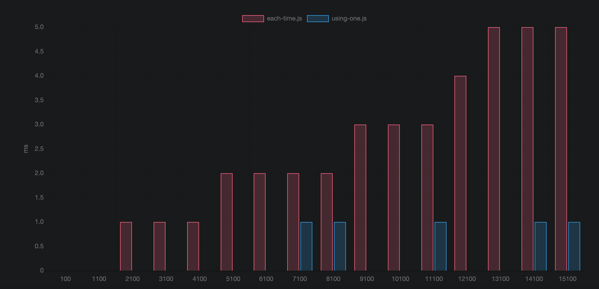

# Micron Benchmark For process.env performance
This is a benchmark to analize the performance between using only one `process.env` or multiple each time.

## Motivation
In this benchmark we measure the performance variation using `process.env` in this two ways:

```javascript
function pwd(){
    return process.env.PWD;
}
```
vs
```javascript
const PWD = process.env.PWD
function pwd(){
    return PWD;
}
```

## Results

As expected using the env variable in a const is the best way to use process.env, this is because process.env make a SO call so if we use this always it'll consume some time.

[view results HERE](https://ivanhuay.github.io/micron-process.env/)


## run the test

```
git clone https://github.com/ivanhuay/micron-process-env.git

cd micron-process-env

npm i

npm run test
```

after running that the results should be on the docs folder.

```
google-chrome docs/index.html 

open docs/index.html
```
